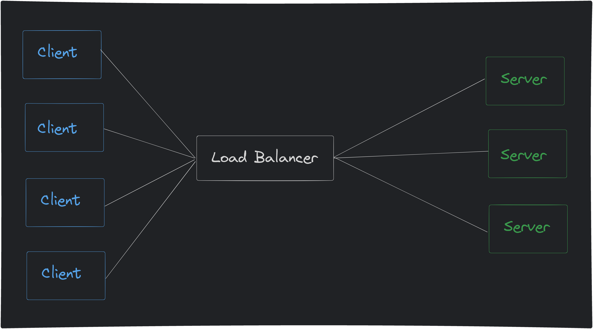
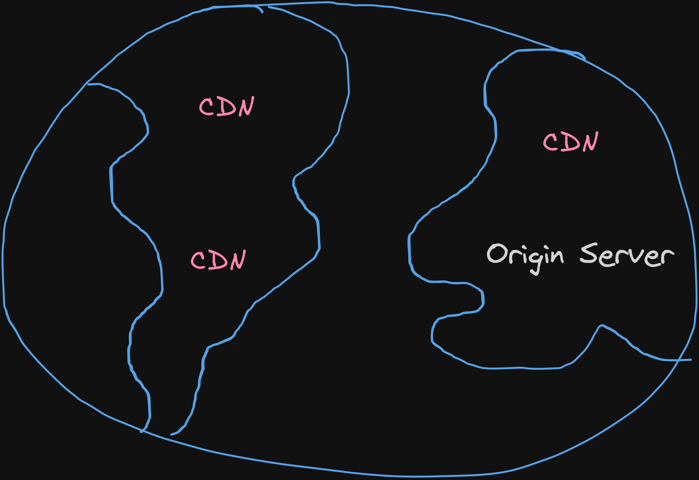

Imagine a bridge designed to handle a specific amount of traffic. Just like a system, it needs careful planning to ensure smooth operation.  The roadway represents the system's functionality, allowing users to move from point A to B. The supports, like the bridge's pillars, represent the underlying infrastructure that keeps everything running. Traffic flow represents user activity and data volume. We can even imagine toll booths as security measures in the system.

The key is to design a bridge (or system) that can handle the expected load. A well-designed bridge can adapt to changing traffic patterns, similar to how a scalable system can accommodate increasing user demands. However, a poorly planned bridge can collapse under too much weight, just like a system failure can lead to data loss or service disruption.

## Breaking down the idea

After having a solid idea of what is the product's main point, it's time to think about the higher levels of it's system design. Usually there are two main aspects that have to be taken into account, and these are the **functional** and **non-functional** aspects of the product.

### 1. Functional Aspects

Here we consider what kinds of functionalities the product should have. For example, let's say we're designing twitter. We must have functionalities
to handle creating and reading a tweet, commenting on it, liking it, etc. These can be split into *user requirements, business requirements and system requirements*

The idea is to ask ourselves **what functionalities should the application have?**, and this is closely related to what's the product main goal. Is it enabling people to communicate to each other with short texts? Is it to provide a highly flexible app where people can create and customize their servers?

After answering this question, we should be able to foresee what are the main functionalities necessary to achieve the desired result.

### 2. Non-Functional Aspects

After understanding what is necessary to achieve the product's purpose, it's time to think about how to keep the system breathing after bringing it to life. This is related to how well the system will perform. Here we try to estimate, based on the product purpose, what hardware and software components will make up the system, what are it's qualities / characteristics

When thinking about the non-functional
aspect of the product we should take some concepts into account to better know what decisions to take next and what tradeoffs will be involved. These concepts
are the system's:

- **Availability**: do we need the system to be available for the users next to 100% of the time? This is affected by the server services
you have contracted

- **Reliability**: this is basically the probability that the system will not fail, and it can be affected by, for example, the number
of servers we have

- **Fault Tolerance**: similar to reliability, the system tolerance to fails in specific parts

- **Redundancy**: the amount of servers running the same code

- **Through Put**: the amount of data or operations we can handle over a specific
period of time. This can be affected by the server resources (amount of RAM, processor, etc) and also by the number
of servers / server instances we have

- **Latency**: the delay between the client making the request and the server response to that request. This is affected by the distance between
the client and the server, the server and the database, etc. Latency can be mitigated by using a CDN (Content Delivery Network)

It's important to consider the best fits for the product's goal:

- What transport protocol should we use?
- What kind of storage would be the best: SQL or NoSQL?
- What about Load Balancers?
- Should we have a CDN?
- Do we need a message queue system?

## Diving Deeper

After bringing the product from the abstract to the concrete plan and cutting it down into solid pieces, let's have a look at the guts of our new system.
Since the functional aspects depend on the product we are working with, we now should focus on understanding the questions that come up when dealing with the non-functional aspect.

### 1. What transport protocol should we use?

Here we have two choices, **TCP** or **UDP**. Again, it depends on your product needs. And of course we can have cases were we have a mix of both. But what are the tradeoffs here?

- TCP
    - Highly reliable (if you lose packets along the way, you get them back)
    - Establishes a connection between the client and the server
    - Slower due to the increased since we have to send more data in the requests to assure the reliability
- UDP
    - Super fast (ideal for video / audio streaming, meeting apps, games - real time applications in general)
    - Doesn't need to establish a connection between the client and the server
    - Not super realiable. If you lose packets, they are gone forever (on some kinds of applications, this is not a big issue)

Having these in mind, we can choose the transport protocol to be implemented based on the product needs.

### 4. "to SQL or to NoSQL" - Buda, probably

To decide between both, you have to take into account what kind of data you're dealing with and also potential needs for horizontal scalability. The tradeoffs here are:

- SQL
    - Structured data
    - Based on a static schema
    - Great for complex and reliable transactions
    - Scales well vertically
- NoSQL
    - Unstructured data
    - Based on a dynamic schema
    - Great for scalability
    - Scales well horizontally

Scalability is a very important trait to consider when designing a system. Of course the amount of users that write to and read from your site will
change over time, but you can make an estimation and decide based on it at first. SQL doesn't scale well horizontally because it follows the A.C.I.D principles for transactions to ensure they are Atomic, Consistent, Isolated and Durable. This doesn't work well when you have to keep data in multiple SQL databases.

### 5. What about Load Balancers?

The main goal of a load balancer is to distribute, based on an algorithm, server requests loads between multiple servers, avoiding overloading a single instance and also allowing the possibility to always send the same user requests to the same server instance based on consistent hashing.

If you have just one server instance, you are at risk of overloading that server, making it's responses slow to all the users if it starts to receive too many requests. Also, having just one instance means your product is more susceptible to fails and unavailability. Having multiple server instances with a load balancer mitigates these problems and allows for horizontal scalability.

Given these facts, it's always important to consider implementing a load balancer layer between your clients and your servers to allow for a better user experience and mitigate the effects of critical fails, avoiding bringing down the product completely.

### 6. Should we have a CDN?

CDN stands for Content Delivery Network, that are basically servers that serve static content and are usually implemented to reduce latency for users. It's able to do it because the CDN to serve the user is usually the one that is geographically closer (not always, sometimes it doesn't have the requested content). It uses caching strategies to store a copy of the data, which avoids the need to query the origin server every time a user makes a request to the CDN

Since CDNs can only serve static content, in other words, content that doesn't change over time, they are limited on usability, so depending on the kind of content you'd like to make available, CDNs might not be the choice 

So the biggest advantages you can achieve using a CDN are basically increasing the system's reliability (if it crashes, CDN will still serve the content) and availability (if the server is unavailable for maintenance reasons, the content will still be served)

### 7. Do we need a message queue system?

This really depends on the amount of data you expect to be dealing with. If you have a fast paced back-end environment with a lot of events happening all around (e.g: receiving / responding to different messages from multiple third party providers), you might consider to implement a message queue to organize the events flow, define processing priorities, etc.

This allows you to handle large amounts of data / requests coming from multiple places. When the server process a message coming from the queue, it will send an acknowledgment message to the queue, stating that the data was received and that the operation was successful. If the queue doesn't receive this acknowledgment message, it will try to send the same message again.

Another cool fact about message queues is that they persist your messages if your server goes down. So if you have a critical fail, you will not lose the queue messages. This, together with the acknowledgment messages, enables the server to come back to the messages to the point where it left them when the fail happened.

## Other important points

- Compliance and regulations
- Localization and internationalization
- Documentation and knowledge sharing
- Caching
- Logging
- Security
- Maintainability

After diving deep into the plan, you should come back to the surface with a valuable treasure, the mental blueprint for a system adapted to the needs of the product you're going to build. Now take off your flippers and let's bring it to life!
 